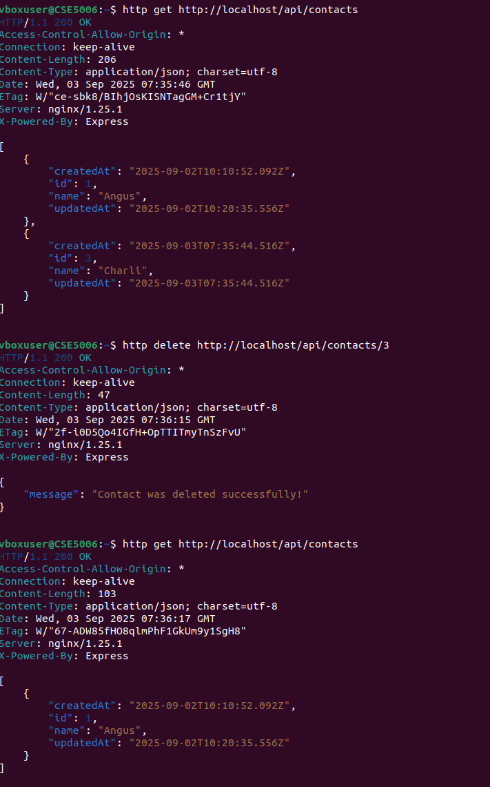
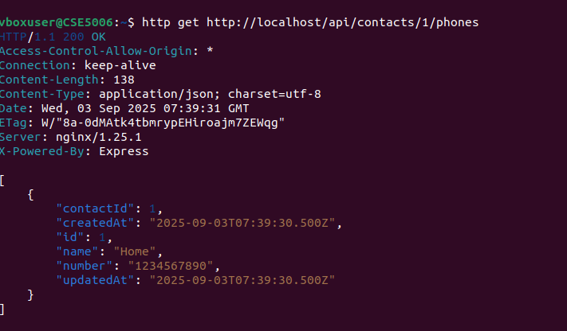
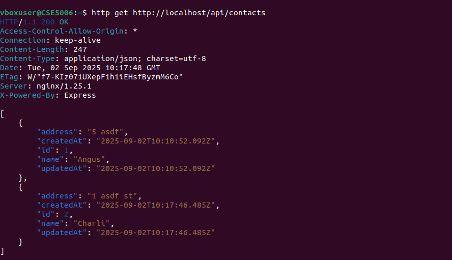
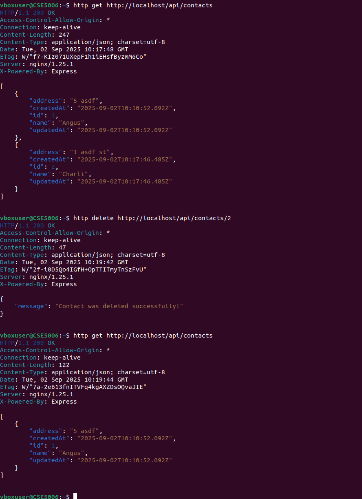
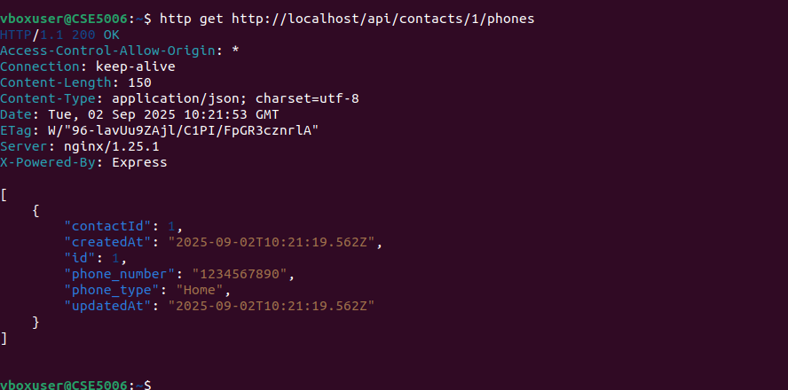
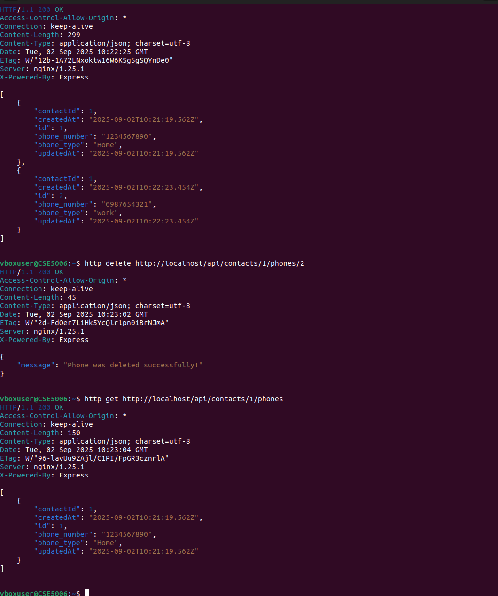

# README.md

IMPORTANT: Once you've cloned this to your forked repository, ensure that you continuously update this document as you complete each task to demonstrate your ongoing progress.

Please include your shared repository link here: https://github.com/19909173/Assignment2.git

Example:
Choiru's shared repository: https://github.com/choiruzain-latrobe/Assignment2.git


Make sure for **your case it is in Private**
## Access Database
1 **Plsql Cheat Sheet:**
You can refer to the PostgreSQL cheat sheet [here](https://www.postgresqltutorial.com/postgresql-cheat-sheet/).

2 **Know the Container ID:**
To find out the container ID, execute the following command:
   ```bash
   docker ps
    9958a3a534c9   testsystem-nginx           "/docker-entrypoint.…"   6 minutes ago   Up 6 minutes   0.0.0.0:80->80/tcp   testsystem-nginx-1
    53121618baa4   testsystem-frontend        "docker-entrypoint.s…"   6 minutes ago   Up 6 minutes   3000/tcp             testsystem-frontend-1
    c89e46ac94b0   testsystem-api             "docker-entrypoint.s…"   6 minutes ago   Up 6 minutes   5000/tcp             testsystem-api-1
    9f4aea7cf538   postgres:15.3-alpine3.18   "docker-entrypoint.s…"   6 minutes ago   Up 6 minutes   5432/tcp             testsystem-db-1
   ```
3. Running the application

**docker compose command:**
   ```bash
   docker compose up --build
   ```

4 **Access postgreSQL in the container:**
Once you have the container ID, you can execute the container using the following command:
You will see the example of running the PostgreSQL inside the container.
   ```bash
   docker exec -it testsystem-db-1 psql -U postgres
   choiruzain@MacMarichoy TestSystem % docker exec -it testsystem-db-1 psql -U postgres                                       
   psql (15.3)
   Type "help" for help.
   
   postgres=# \dt
             List of relations
    Schema |   Name   | Type  |  Owner   
   --------+----------+-------+----------
    public | contacts | table | postgres
    public | phones   | table | postgres
   (2 rows)
  
    postgres=# select * from contacts;
    id |  name  |         createdAt         |         updatedAt         
   ----+--------+---------------------------+---------------------------
     1 | Helmut | 2024-08-08 11:57:57.88+00 | 2024-08-08 11:57:57.88+00
    (1 row)
    postgres=# select * from phones;
    id | phone_type |   number    | contactId |         createdAt          |         updatedAt          
   ----+------------+-------------+-----------+----------------------------+----------------------------
     1 | Work       | 081431      |         1 | 2024-08-08 11:59:04.386+00 | 2024-08-08 11:59:04.386+00


postgres=# select * from contacts;
   ```
Replace `container_ID` with the actual ID of the container you want to execute.

## Executing API Task 2

### Contact API


1. Add contacts API  (POST)
```bash
http post http://localhost/api/contacts name="Charli"
```

2 Get contacts API  (GET)

```bash
http get http://localhost/api/contacts
```


3. Show/create the API commmand to delete the contacts (DELETE)

```bash
http delete http://localhost/api/contacts/3
```


4. Show/create the API command to edit the contacts (PUT)
```
http put http://localhost/api/contacts/1 name="Eddie"
```


### Phone API
1. Get Phones 
```
http get http://localhost/api/contacts/1/phones
```


2. Add Phones 
```
http post http://localhost/api/contacts/1/phones name="Work" number="0987654321"
```


3. Delete Phones 
```
http delete http://localhost/api/contacts/1/phones/3
```


4. Update Phones 
```
http put http://localhost/api/contacts/1/phones/1 number="0987654321"
```


## Executing API Task 3

### Contact API


1. Add contacts API  (POST)
```bash
http post http://localhost/api/contacts name="Charli" address="1 asdf st"
```

2 Get contacts API  (GET)

```bash
http get http://localhost/api/contacts
```



3. Show/create the API commmand to delete the contacts (DELETE)

```bash
http delete http://localhost/api/contacts/2
```


4. Show/create the API command to edit the contacts (PUT)
```
http put http://localhost/api/contacts/1 address="9 fdsa rd"
```


### Phone API
1. Get Phones 
```
http get http://localhost/api/contacts/1/phones
```


2. Add Phones 
```
http post http://localhost/api/contacts/1/phones phone_type="work" phone_number="0987654321"
```


3. Delete Phones 
```
http delete http://localhost/api/contacts/1/phones/2
```


4. Update Phones 
```
http put http://localhost/api/contacts/1/phones/1 phone_number="0987654321"
```


## Task 4
### Company API
1. Get Company
```
http get http://localhost/api/contacts/1/company
```


2. Add Company
```
http post http://localhost/api/contacts/1/company company_name="RMIT" company_address="10 asdf st"

```


3. Delete Company 
```
http delete http://localhost/api/contacts/1/company/5
```


4. Update Company
```
http put http://localhost/api/contacts/1/company/3 company_name="Uni"
```


## Task 5